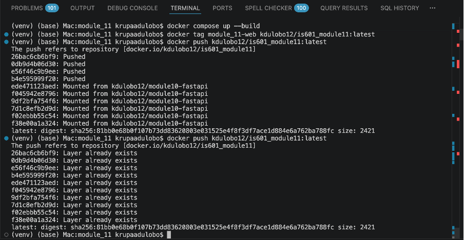

# 📌 Project Overview

This project extends a FastAPI-based calculator application by implementing a **Calculation model using SQLAlchemy**, robust validation using **Pydantic schemas**, and a complete **CI/CD pipeline**.

The application integrates PostgreSQL for persistence, uses a factory pattern for calculation logic, and includes unit and integration tests. Docker is used for containerization, and GitHub Actions automates testing and deployment to Docker Hub.

This module focuses on backend modeling, validation, and CI/CD automation.

---

# ⚙️ Features

- FastAPI calculator backend
- SQLAlchemy Calculation model
- Pydantic schema validation
- Factory pattern for operations (Add, Subtract, Multiply, Divide)
- PostgreSQL database integration
- Unit and integration testing
- Dockerized application
- GitHub Actions CI/CD pipeline
- Docker Hub image deployment

---

# 🧮 Calculation Model

The Calculation model includes:

- `id` (Primary Key)
- `a` (First operand)
- `b` (Second operand)
- `type` (Operation type: Add, Sub, Multiply, Divide)
- `result` (Optional stored result)

---

# 🧠 Factory Pattern

A factory pattern is used to handle different calculation types:

- Add
- Subtract
- Multiply
- Divide

This improves scalability and keeps logic clean and modular.

---

# 🔐 Validation (Pydantic)

## CalculationCreate
- Accepts: `a`, `b`, `type`
- Validates:
  - Operation type must be valid
  - Division by zero is prevented

## CalculationRead
- Returns:
  - id, a, b, type, result

---

# 📦 Project Structure
.
├── app/
│ ├── models/
│ │ └── calculation.py
│ ├── schemas/
│ │ └── calculation.py
│ ├── operations/
│ │ └── factory.py
│ ├── database.py
│ └── main.py
├── tests/
│ ├── unit/
│ ├── integration/
│ └── e2e/
├── docker-compose.yml
├── Dockerfile
├── requirements.txt
├── README.md
└── Reflection.md

---

# 🧪 Testing

## Test Types

### Unit Tests
- Validate each operation type
- Test factory pattern logic
- Test schema validation

### Integration Tests
- Database insertions
- Data correctness verification
- Error handling (invalid inputs)

---

# 📊 Coverage

- High test coverage across models and validation
- Tests run automatically in CI pipeline

---

# 🐳 Running the Project Locally

## Step 1: Clone Repo

```bash
git clone https://github.com/kdulobo12/IS601_Module11
cd IS601_Module11
Step 2: Setup Virtual Environment
python3 -m venv venv
source venv/bin/activate
pip install -r requirements.txt
Step 3: Run with Docker
docker compose down -v
docker compose up --build
Step 4: Access Application
FastAPI App → http://localhost:8000
Swagger Docs → http://localhost:8000/docs
pgAdmin → http://localhost:5050

## 🧪 Run Tests

pytest
With coverage:
pytest --cov=app --cov-report=html
Open:
htmlcov/index.html

## 🔄 CI/CD Pipeline
GitHub Actions workflow performs:
Install dependencies
Run unit + integration tests
Build Docker image
Run security scan (Trivy)
Push image to Docker Hub

## 🐳 Docker Hub Repository
👉 Docker Image Link:
https://hub.docker.com/r/kdulobo12/is601_module11

## 📸 Screenshots
✅ GitHub Actions Success


✅ Docker Hub Image


Link: https://hub.docker.com/r/kdulobo12/is601_module11

##📋 Submission Checklist

SQLAlchemy Calculation Model
Pydantic Schemas
Factory Pattern
Unit Tests
Integration Tests
Docker Setup
GitHub Actions
Docker Hub Deployment
README Documentation
Reflection

##🧠 Reflection
This project helped me understand how backend systems are structured using models, validation, and testing. Implementing the Calculation model using SQLAlchemy taught me how to design database schemas and manage structured data effectively.
One of the key challenges I faced was ensuring correct validation using Pydantic, especially handling edge cases such as division by zero and invalid operation types. This improved my understanding of input validation and data integrity.
Another major learning experience was working with Docker and PostgreSQL. I encountered issues with port conflicts and database volume mismatches, which required cleaning Docker volumes and properly configuring containers. This helped me understand how containerized databases behave across builds.
The CI/CD pipeline setup using GitHub Actions was also very valuable. I learned how to automate testing, build Docker images, and deploy them to Docker Hub. Debugging issues like missing secrets and incorrect image naming conventions taught me the importance of configuration in deployment pipelines.
Overall, this project strengthened my understanding of backend development, testing strategies, containerization, and deployment workflows. It provides a strong foundation for building more advanced features in future modules.

👩‍💻 Author
Krupa Adulobo
GitHub: https://github.com/kdulobo12
